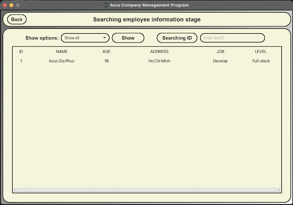
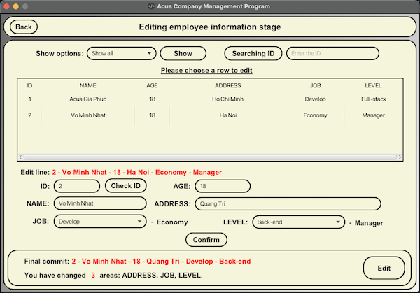
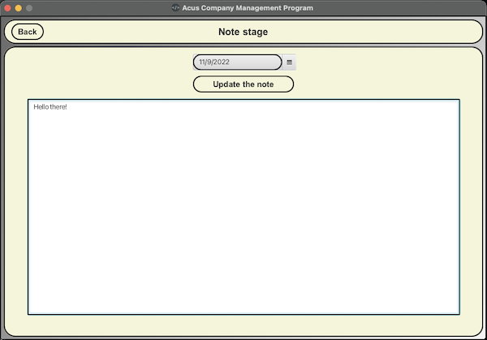

# Employee Management - version: EM.02

- This is a management program of human resource in a company (In this program, the company's name is Acus)
- Project link (GitHub) : https://github.com/phamgiaphuc/EmployeeManagement-EM.02
- Project's author: Pham Gia Phuc - Acus
- Personal profile: https://github.com/phamgiaphuc

### Languages and tools in this project:

1. Java (Back-end).
2. Object-Oriented Programming (OOP) and OOP principles.
3. JavaFX and CSS (Front-end).
4. Maven.
5. Class and sequence diagram.

-----------------------------------
<ins>

### USER GUIDE

</ins>

### STEP 1:  Before running program, you make sure your computer already installed tools below:

- JDK version 18.0.2 or later.
- JFX version 18.0.2 or later.
- Maven version 4.0.0 or later.

> I recommend JDK and JFX version must be match in order to have full experience to run the program successfully.

### STEP 2: Program is configured as follows

**2.1 When running the program, admins enter a welcome stage which has _four functions_: sign-in, sign-out,
  information and exit:**

- Sign-in: Users have to log in by a registered account. If they do not have any accounts or forget the log-in account, they need to go to the sign-up stage or password restoration.
- Sign-up: Users register an admin account. Each admin account has a specific PRIVACY code which help users to get back the password.
- Information: To know more about the project.
- Exit: Exit the program.

**2.2 After signing in successfully, there is an admin stage which contains _six functions_: add, search, edit, delete, note, admin:**

- Add: Adding employee information to the data.
- Search: Show employee or search a specific employee by the ID.
- Edit: Edit employee information.
- Delete: Delete employee information.
- Note: Note section for admins.
- Admin: Changing admin account like avatar, password and nickname.

### STEP 3: Run the program

Click the file path below:

- To run the program, click [here](src/main/java/application/employeemanagement/Welcome.java).

-----------------------------------
<ins>

### OPERATING ILLUSTRATION PICTURES

</ins>

### Sign-in stage/Welcome stage

     

### Admin stage

**1. Add**

**2. Search**

**3. Edit**

**4. Delete**

**5. Note**

**6. Admin**

