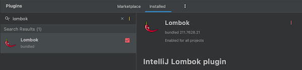
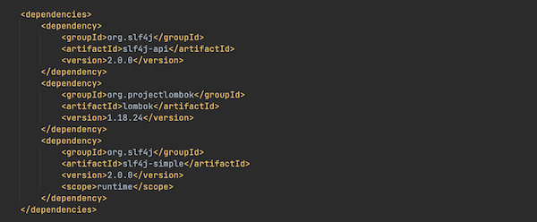
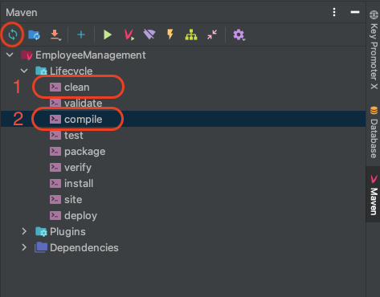

# Employee Management - version: EM.02

- This is a management program of human resource in a company with a log-in stage. (In this program, the company's name is Acus)
- Project link (GitHub) : https://github.com/phamgiaphuc/EmployeeManagement-EM.02
- Project's author: Pham Gia Phuc - Acus
- Personal profile: https://github.com/phamgiaphuc

### Languages, tools and topics in this project:

1. Java (Back-end).
2. Object-Oriented Programming (OOP) and OOP principles.
3. JavaFX and CSS (Front-end).
4. Maven.
5. Lombok library.

-----------------------------------
<ins>

### USER GUIDE

</ins>

### STEP 1:  Before running program, you make sure your computer already installed tools below:

- JDK version 18.0.2 or later.
- JFX version 18.0.2 or later.
- Maven version 4.0.0 or later.

> **Advice:** I recommend JDK and JFX version must be match in order to have full experience to run the program successfully.

- Check the **pom.xml** and **module-info.java** if the third library Lombok is already installed in the files

> **Notice:** If the library is not installed, check the **"Install third library guide"** section.

### STEP 2: Program is configured as follows:

**2.1 When running the program, admins enter a welcome stage which has _four functions_: sign-in, sign-out, information
and exit:**

<div align="center">
  
</div>

- **Sign-in**: Users have to log in by **a registered account**. If they do not have any accounts or forget the log-in account,
  they need to go to the **sign-up stage** or **password restoration**.
- **Sign-up**: Users register an admin account. Each admin account has **a specific PRIVACY code** which help users to get back
  the password.
- **Information**: To know more about the project.
- **Exit**: Exit the program.

> **Notice:** I have already created an account. You can check the account by clicking [here](src/main/java/project/account/data/admin-accounts-data.txt). Or you can sign up your own account.

**2.2 After signing in successfully, there is an admin stage which contains _six functions_: add, search, edit, delete,
note, admin:**

<div align="center">
  
</div>

- **Add**: Adding employee information to the data.
- **Search**: Show employee or search a specific employee by the ID.
- **Edit**: Edit employee information.
- **Delete**: Delete employee information.
- **Note**: Note section for admins.
- **Admin**: Changing admin account like avatar, password and nickname.

### STEP 3: Run the program

Click the file path below:

- To run the program, click [here](src/main/java/application/employeemanagement/Welcome.java).

-----------------------------------
<ins>

### PROJECT ROOT

</ins>

```
    java
    |__ application.employeemanagement  #user interface and functions in the program
        |__ function
    |__ project
        |__ acount  #admin/sign-in accounts
            |__ data
        |__ employee  #employee data
            |__ base
            |__ engineer
            |__ worker
    |__ utilities
    
    resources
    |__ application.employeemanagement #fxml files and utilities
        |__ avatar
        |__ css
        |__ photo
    |__ configuration  #system and library configuration
```

-----------------------------------
<ins>

### OPERATING ILLUSTRATION PICTURES

</ins>

- If you want to see more pictures, click [here](src/main/resources/readme/SHOWME.md).

-----------------------------------

<ins>

### INSTALLING THIRD LIBRARY GUIDE

</ins>

> **Advice:** Please follow the steps below otherwise the program can not run.

#### Step 1:

- Go to 'Preferences' then go to 'Plugins' and type 'lombok' to search. It will look like this.




#### Step 2:

- Enable Lombok then press Apply and OK.

#### Step 3:

- In the **pom.xml file**, remember to add this code like in the picture.

`code:`

```
    <dependency>
        <groupId>org.slf4j</groupId>
        <artifactId>slf4j-api</artifactId>
        <version>2.0.0</version>
    </dependency>
    <dependency>
        <groupId>org.projectlombok</groupId>
        <artifactId>lombok</artifactId>
        <version>1.18.24</version>
    </dependency>
    <dependency>
        <groupId>org.slf4j</groupId>
        <artifactId>slf4j-simple</artifactId>
        <version>2.0.0</version>
        <scope>runtime</scope>
    </dependency>
```

`picture:`



> **Notice:** Remember to **clean, compile and reload** the file again.
 


- In the **module-info.java file**, remember to import the library.

```java
    requires lombok;
    requires org.slf4j;
```

#### Step 4:

- Everytime you want to use the third library, just enter "@Slf4j" on the head of the class like this.

```java
    package project.account;

    import lombok.extern.slf4j.Slf4j;
    
    @Slf4j 
    public class Restoration {
        // Variables...
    }
```

#### Step 5:

- It's done. Check the configuration again and run the program.

