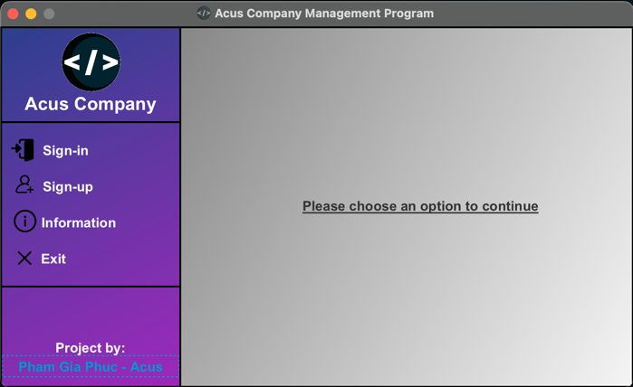
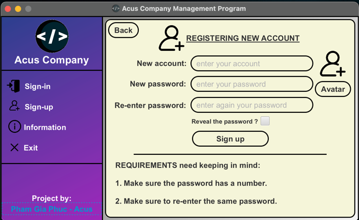
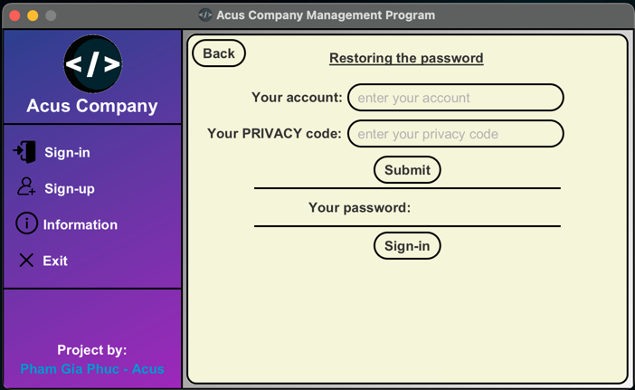
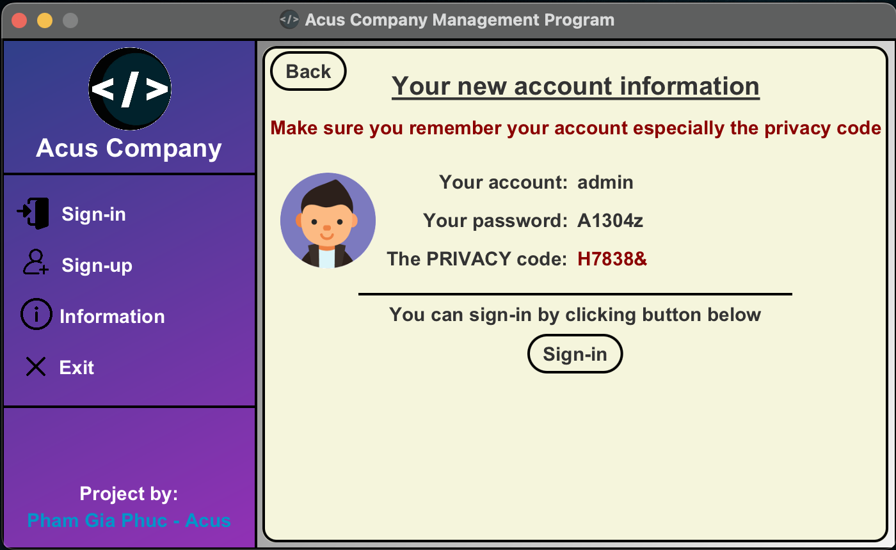
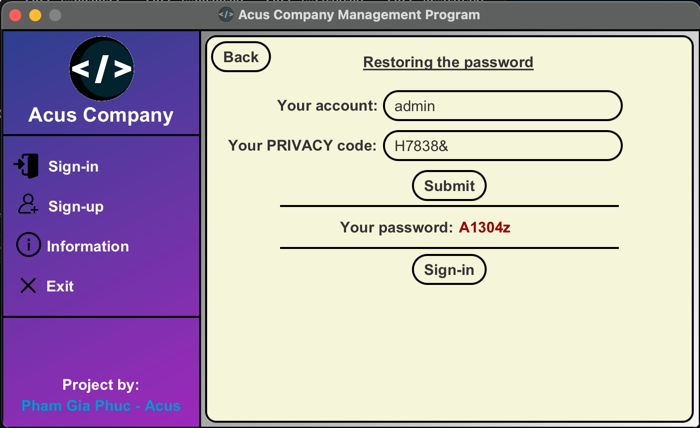

# Employee Management - version: EM.02

- This is a management program of human resource in a company (In this program, the company's name is Acus)
- Project link (GitHub) : https://github.com/phamgiaphuc/EmployeeManagement-EM.02
- Project's author: Pham Gia Phuc - Acus
- Personal profile: https://github.com/phamgiaphuc

### Languages and tools in this project:

1. Java (Back-end).
2. Object-Oriented Programming (OOP) and OOP principles.
3. JavaFX and CSS (Front-end).
4. Maven.
5. Class diagram.

-----------------------------------
<ins>

### USER GUIDE

</ins>

### STEP 1:  Before running program, you make sure your computer already installed tools below:

- JDK version 18.0.2 or later.
- JFX version 18.0.2 or later.
- Maven version 4.0.0 or later.

> I recommend JDK and JFX version must be match in order to have full experience to run the program successfully.

### STEP 2: Program is configured as follows

- When running the program, admins enter a welcome view which has **four functions**: sign-in, sign-out,
  information and exit.

- After signing in successfully, there is an admin view which contains **seven functions**: dashboard, add, show, edit, delete, comment, admin
  and basic things like exit, settings,... buttons.

### STEP 3: Run the program

Click the file path below:

- To run the program, click [here](src/main/java/application/employeemanagement/Welcome.java).

-----------------------------------
<ins>

### OPERATING ILLUSTRATION PICTURES

</ins>

**1. Welcome users or admins:**

**2. Sign-in:**

**3. Sign-up:**

**4. Forgot the password:**

**5. When users successfully create accounts:**

**6. When users forgot their account passwords:**

